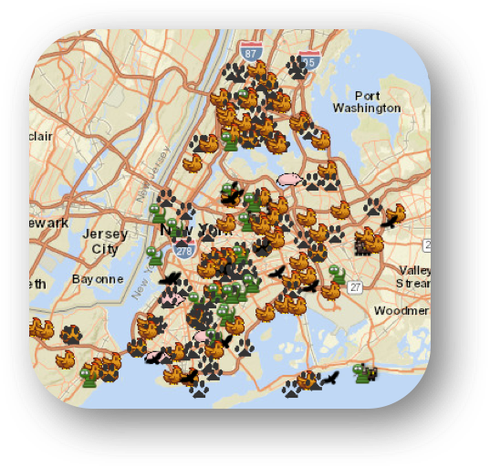

```{r  echo=FALSE,results="asis", message=FALSE, warning=FALSE, comment= NA}
library(knitr)
library(ggplot2)
library(leaflet)
library(tigris)
library(plyr)
require(rCharts)

#explain level
#http://stackoverflow.com/questions/32206623/what-does-level-mean-in-ggplotstat-density2d

animal = read.csv("animialSubset.csv", na.strings = "NA")

desc =as.data.frame(summary(animal$Descriptor))
comp = as.data.frame(summary(animal$Complaint.Type))
loc = as.data.frame(summary(animal$Location.Type))
dog_noise = animal[animal$Descriptor == "Noise, Barking Dog (NR5)",]
pests = animal[animal$Descriptor == "PESTS",]
dog_noise_manha = dog_noise[dog_noise$Borough == "MANHATTAN",]
#summary(dog_noise_manha$Incident.Zip)
dog_noise_2015 = dog_noise[dog_noise$Year == "2015",]
#summary(dog_noise_2015$Borough)

bronx_popu = 1455444
brooklyn_popu = 2636735
manhattan_popu = 1644518
queens_popu = 2339150
staten_popu = 474558

dog_noise_2015_manhattan = dog_noise_2015[dog_noise_2015$Borough == "MANHATTAN" ,]
#sankey plot
#sankey plot require input as a data frame has three columns (source, target, value), the value is total out going edge of each source
agency = animal$Agency
descriptor = animal$Descriptor
sankey_df = data.frame(descriptor, agency)
colnames(sankey_df) = c("source", "target")
#this count function is from the plyr library, will count the occurance of each value in source column of sankey_df and return a data frame
sankey_count <- count(sankey_df, 'source')
#merge orignal data frame with the count data frame, then each column will contains the count of the source
sankey_df = merge(x= sankey_df,y= sankey_count, by = "source", all.x = TRUE )
colnames(sankey_df) = c("source", "target", "value")


#summary(animal$Descriptor)

borough = animal$Borough
temp = data.frame(agency,borough)
colnames(temp) = c("source", "target")
temp_count <- count(temp, c("source",'target'))
temp = merge(x= temp,y= temp_count, by = c("source","target"), all.x = TRUE )
colnames(temp) = c("source", "target", "value")

sankey_new <- rbind(sankey_df, temp) 
sankey_new = sankey_new[!duplicated(sankey_new), ]
#sankey_new[df=="12 Dead Animals"]<-"Dead Animals Sanitation Problem"

#DPR dead animal :Animal in a Park 
#DSNY dead animal :Sanitation Condition
#DOT dead animal :Highway 

##aa = animal[animal$Agency == "NYPD",]
#summary(aa$Descriptor)

sankeyPlot <- rCharts$new()
sankeyPlot$setLib('http://timelyportfolio.github.io/rCharts_d3_sankey/libraries/widgets/d3_sankey')
sankeyPlot$set(
  data = sankey_new,
  nodeWidth = 15,
  nodePadding = 10,
  layout = 32,
  #layout = 50,
  #width = 960,
  width = 800,
  height = 600,
  units = "complaints",
  title = "Sankey Diagram---Complaints related to animals"
)
#sankeyPlot

```
```{r  echo=FALSE,results="asis", message=FALSE, warning=FALSE, comment= NA, out.width=900}
#gross rent 
counties = c(5,47,61,81,85)
tracts_ny = tracts(state = "NY", county = counties, cb = TRUE)


#tracts[[4]] is geoid
ny_city = read.csv("ct_nyc_clean.csv", na.strings = "NA")
ny_city$Id2 = as.character(ny_city$Id2)

median_rent_merged = geo_join(tracts_ny, ny_city, "GEOID", "Id2")

rent = as.data.frame(median_rent_merged)
pal = colorNumeric(palette = "YlGnBu", domain = rent$median_rent)
popup = paste0("GEOID: " , rent$Id2, "<br>", "median house rent: ", rent$median_rent)

map1 = leaflet() %>%
  addProviderTiles("CartoDB.Positron") %>%
  addPolygons(data = median_rent_merged,
              fillColor = ~pal(median_rent),
              color = "#b2aeae",
              fillOpacity = 0.5,
              weight = 1,
              smoothFactor = 0.2,
              popup = popup
              ) %>%
  addLegend(pal = pal,
            values = rent$median_rent,
            position = "bottomright",
            title = "Median House rent "
            #labFormat = labelFormat(prefix = "$")
            )
#map1
```


```{r global_options, include=FALSE}
knitr::opts_chunk$set(echo=FALSE, warning=FALSE, message=FALSE)
```

```{r setup, echo=FALSE, warning=FALSE, message=FALSE}
if (!require("RColorBrewer")) install.packages("RColorBrewer")
if (!require("rpart.plot")) install.packages("rpart.plot")
if (!require("plotly")) install.packages("plotly")
if (!require("circlize")) install.packages("circlize")
if (!require("RColorBrewer")) install.packages("RColorBrewer")
if (!require("data.table")) install.packages("data.table")
if (!require("Rmisc")) install.packages("Rmisc")
if (!require("dplyr")) install.packages("dplyr")
if (!require("tidyr")) install.packages("tidyr")
if (!require("ggplot2")) install.packages("ggplot2")
if (!require("ggmap")) install.packages("ggmap")
library("circlize")
library('data.table')
library('reshape')
library('RColorBrewer')
library('rpart.plot')
library('dplyr')
library('tidyr')
library('ggmap')

```

##I. Introduction

Text Text Text Text Text Text Text Text Text Text

##II. Exploratory Analysis

We explored the 311 calls about animals from several perspectives. We studied the geographic distributions of some illegal pets, different complaint patterns by agency and by time. Here is a simple summary dashboard for all the animal-related 311 calls since 2010.

In the following plot, we show all the animal related complaints. There are many knowledge we can get from the plot. The leftmost column show all the complaints types related to animals. The middle column shows the agencies. The rightmost column shows the boroughs. The width of each line shows the size of count. From the plot, we can know which type of complaints is handled by which agencies and how many complaints were handled. We can also know for each agency the amount of complaints from each borough. 

```{r  echo=FALSE,results="asis", message=FALSE, warning=FALSE, comment= NA}
sankeyPlot$show("iframesrc", cdn = TRUE)
```


###2.1 Unusual Pet Complaints  

While investigating the different animal related complaints in the dataset we found those related to "unusual", "exotic" or "illegal" pet complaints to be among the most interesting calls. Unfortunately the current 311 website does not provide too much details on the calls and the specifics of what was being reported, however we found out that an archived earlier version of this dataset on which calls were detailed, so finding it interesting and relevant for our analysis we decided to scrape it.

The archived file is on JSON format, and can be accessed on the web on this [link](https://goo.gl/Vv5cBS). To process it and convert it into a standard table format that could be consumed by R's mapping libraries we utilized Python's Pandas and NLTK libraries. An iPython notebook with the complete scripts can be found as an attachment, and here we summarize the steps we took in order to extract and map the most relevant information.

1) We noticed that the JSON was not correctly formatted, as it had some unmatched curly brackets and deeply nested objects with no valuable information. As a first step we cleaned up the file, so that it could be consumed by Pandas.  
2) Once the file was in a clean and tidy format, we proceeded to extract relevant information such as the call content, its latitude, longitude, address, locality and time when it was reported.  
3) Next we used NLTK to do some text mining on the call contents. We removed stopwords and tokenized the words so we could extract relevant entities such as the name of the animal being reported (i.e. pig, rooster, etc.).  
4) After this the data was exported into a CSV and loaded into R for further analysis.

Below we present some summary statistics related to the nature of complaints in all New York and their distribution per borough / locality. The label pet refers to other less represented animals (including examples such as rats, kangaroos, wolf-dogs and bobcats).

```{r pet-complaints, fig.height=5, fig.width=12}
complaints <- read.csv("complaints_details.csv", stringsAsFactors = F)
names(complaints) <- c("details", "date", "street", "city", "zip", "lat", "lon", "animal1","animal2")

## Unique animals.
complaints[complaints$animal1 == "snakes",]$animal1 <- "snake"
complaints[complaints$animal1 %in% c("birds","bird","crows","crow"),]$animal1 <- "bird"
complaints[complaints$animal1 %in% c("chickens","chicken","rooster","roosters"),]$animal1 <- "chicken"
complaints[complaints$animal1 == "pigs",]$animal1 <- "pig"
#complaints[complaints$animal1 == "racoons",]$animal1 <- "racoon"
complaints[complaints$animal1 == "",]$animal1 <- "pet"

## Common Animals per Burrough.
all.commons <- complaints %>%
  select(-details, -animal2) %>%
  spread(key = animal1, value = zip) %>%
  summarize_each(funs(sum(!is.na(.))), bird, chicken, pet, pig, racoon, snake) %>%
  gather() %>%
  select(animal = key, counts = value)

commons <- complaints %>%
  select(-details, -animal2) %>%
  spread(key = animal1, value = zip) %>%
  group_by(city) %>%
  summarize_each(funs(sum(!is.na(.))), bird, chicken, pet, pig, racoon, snake) %>%
  filter(city %in% c("Bronx", "Brooklyn", "Staten Island", "New York")) %>%
  gather(key = city)

names(commons) <- c("city", "animal", "counts")

## All NT Common Animals.
ny.animal <- ggplot(all.commons) +
  geom_bar(aes(x=reorder(animal, -counts), y=counts, fill=animal), stat = "identity", position = "dodge") +
  scale_fill_brewer(palette = "Pastel1") + theme_minimal() +
  labs(x = "Animal", y = "", title = "All New York City") + theme(legend.position = "bottom")

ny.animal

## Brooklyn Common Animals.
brooklyn.animal <- ggplot(commons[commons$city == "Brooklyn",]) +
  geom_bar(aes(x=reorder(animal, -counts), y=counts, fill=animal), stat = "identity", position = "dodge") +
  scale_fill_brewer(palette = "Pastel1") + theme_minimal() +
  labs(x = "Animal", y = "", title = "Brooklyn") + theme(legend.position = "bottom")

## Brooklyn Common Animals.
brooklyn.animal <- ggplot(commons[commons$city == "Brooklyn",]) +
  geom_bar(aes(x=reorder(animal, -counts), y=counts, fill=animal), stat = "identity", position = "dodge") +
  scale_fill_brewer(palette = "Pastel1") + theme_minimal() +
  labs(x = "Animal", y = "", title = "Brooklyn") + theme(legend.position = "bottom")

## Manhattan Common Animals.
manhattan.animal <- ggplot(commons[commons$city == "New York",]) +
  geom_bar(aes(x=reorder(animal, -counts), y=counts, fill=animal), stat = "identity", position = "dodge") +
  scale_fill_brewer(palette = "Pastel1") + theme_minimal() +
  labs(x = "Animal", y = "", title = "Manhattan") + theme(legend.position = "bottom")

multiplot(brooklyn.animal, manhattan.animal, cols = 2)

## Bronx Common Animals.
bronx.animal <- ggplot(commons[commons$city == "Bronx",]) +
  geom_bar(aes(x=reorder(animal, -counts), y=counts, fill=animal), stat = "identity", position = "dodge") +
  scale_fill_brewer(palette = "Pastel1") + theme_minimal() +
  labs(x = "Animal", y = "", title = "Bronx") + theme(legend.position = "bottom")

## Staten Island Animals.
staten.animal <- ggplot(commons[commons$city == "Staten Island",]) +
  geom_bar(aes(x=reorder(animal, -counts), y=counts, fill=animal), stat = "identity", position = "dodge") +
  scale_fill_brewer(palette = "Pastel1") + theme_minimal() +
  labs(x = "Animal", y = "", title = "Staten Island") + theme(legend.position = "bottom")

multiplot(bronx.animal, staten.animal, cols = 2)
```

We can see that in all 4 boroughs (data from Queens was missing) the most common exotic pet are roosters and chickens. These also happen to be the most annoying or frightening animals, which could be an alternative explanation of why they are reported so much. Exotic birds, on the other hand, might be considered illegal, but people might not bother to report them as they are not a threat to them.

No we proceed to visualize the distribution of the reports for the four most common exotic pet types throughout New York city.

```{r pet-dist, fig.height=6, fig.width=12}
# ROOSTERS.
map <- get_map(location = c(-74.0059, 40.7128), zoom = 11)

roosters.map <- ggmap(map, extent='panel') +
  ggtitle("Rooster Complaints Density in Manhattan") +
  stat_density2d(data=complaints[complaints$animal1 == "chicken",c("lat", "lon")],
                 aes(x=lon, y=lat,  fill = ..level.., alpha = ..level..),
                 size = 0.01,  geom = 'polygon')+
  scale_fill_gradient(low = "green", high = "red") +scale_alpha(range = c(0, 0.5), guide = FALSE)

## PIGS.
pigs.map <- ggmap(map, extent='panel') +
  ggtitle("Pig Complaints Density in Manhattan") +
  stat_density2d(data=complaints[complaints$animal1 == "pig",c("lat", "lon")],
                 aes(x=lon, y=lat,  fill = ..level.., alpha = ..level..),
                 size = 0.01,  geom = 'polygon')+
  scale_fill_gradient(low = "green", high = "red") +scale_alpha(range = c(0, 0.5), guide = FALSE)

## SNAKES.
snakes.map <- ggmap(map, extent='panel') +
  ggtitle("Snake Complaints Density in Manhattan") +
  stat_density2d(data=complaints[complaints$animal1 == "snake",c("lat", "lon")],
                 aes(x=lon, y=lat,  fill = ..level.., alpha = ..level..),
                 size = 0.01,  geom = 'polygon')+
  scale_fill_gradient(low = "green", high = "red") +scale_alpha(range = c(0, 0.5), guide = FALSE)

## CROWS.
crows.map <- ggmap(map, extent='panel') +
  ggtitle("Exotic Birds Complaints Density in Manhattan") +
  stat_density2d(data=complaints[complaints$animal1 == "bird",c("lat", "lon")],
                 aes(x=lon, y=lat,  fill = ..level.., alpha = ..level..),
                 size = 0.01,  geom = 'polygon')+
  scale_fill_gradient(low = "green", high = "red") +scale_alpha(range = c(0, 0.5), guide = FALSE)

multiplot(snakes.map, crows.map, cols = 2)

multiplot(pigs.map, roosters.map, cols = 2)
```

The maps reveal some interesting patterns, as the distribution of the illegal pets is not the same across the city. Snakes tend to be concentrated on the center of Brooklyn, while exotic birds are in the north area. Roosters are apparently popular all across this boroughs and the Bronx, while pigs are prevalent on the southern Brooklyn area. As the earlier plots revealed, Manhattan and Staten Island do not show any particular concentration mainly due to the low number of reports on these areas.

Finally, we decided to create an interactive explorer for unusual pet complaints, where the user is able to navigate through New York city and identify complaints as animal markers. The specific call content is displayed when the user clicks on the icon. To visit the interactive app, click on the link below.

<div style="width:200px; height:200px;"text-align:center;">
  <a href="https://masta-g3.shinyapps.io/pets/"></a>
</div>

###2.2 Agency

Text Text Text Text Text Text Text Text Text Text

###2.3 Time

Text Text Text Text Text Text Text Text Text Text

Text Text Text Text Text Text Text Text Text Text

##III. A Case Study -- Pigeons

Text Text Text Text Text

##IV. Correlation and Predictive Analysis

### 4.1 Relationship between Rent Price and Dog/Pests Complaints
The first thing we want to discover is the correlation between the house rent and the dog's noise complaints. We first plot the house rent of New York City. The darker the color the higher the rent. As we can see the rent of upper east region of Manhattan is very high. The rent of house in Bronx relatively low. Then we plot the heat map of dog's noise complaints of Manhattan and also heat map of pest complaints of whole New York City. 

```{r  echo=FALSE,results="asis", message=FALSE, warning=FALSE, comment= NA, out.width=900}
map1
```
As we can see from the heat map of dog's noise complaints below. The density of complaints is very high in the upper east region. This leads to teh conclusion that there is a positive relation between number of dog's noise complaints and house rent. 

```{r  echo=FALSE,results="asis", message=FALSE, warning=FALSE, comment= NA, fig.align='center'}

#dog_noise manhattan only
new_york_map <- get_map(location="new york chelsea", zoom = 12)
ggmap(new_york_map, extent='device')+ ggtitle("Dog Noise Complaints Density Estimation Manhattan") +stat_density2d(data=dog_noise_2015_manhattan, aes(x=Longitude, y=Latitude,  fill = ..level.., alpha = ..level..), size = 0.01,  geom = 'polygon')+
scale_fill_gradient(low = "green", high = "red") +scale_alpha(range = c(0, 0.5), guide = FALSE)
```

From the heat map of the pests complaints below, we can find the density of complaints is very high in Harlem and Bronx. This leads to the conclusion that there is negative relation between the number of complaints about pests and house rent. 

```{r  echo=FALSE,results="asis", message=FALSE, warning=FALSE, comment= NA, fig.align='center'}
#pests map all new york
pests_2015 = pests[pests$Year == "2015",]
new_york_map <- get_map(location="new york", zoom = 11)
ggmap(new_york_map, extent='device')+ ggtitle("Pests Complaints Density Estimation") + stat_density2d(data=pests_2015, aes(x=Longitude, y=Latitude,  fill = ..level.., alpha = ..level..), size = 0.01,  geom = 'polygon')+
scale_fill_gradient(low = "green", high = "red") +scale_alpha(range = c(0, 0.5), guide = FALSE) 
```


### 4.2 Predictive Analysis on Case Length -- Decision Trees

After exploring different features of the 311 calls, we would like to build up a predictive model to predict how long a case may take based on animal type, season, borough, agency, etc.

We created a new variable indicating what kind of animal was mentioned in each case. Before digging into the model, we first looked at the features of complaints related to different animals and their relationship between other key variables. The following two circos plot show the relationship between animal types and the season, as well as the relationship between animal types and the county (borough). Please note that we did not include dogs and pests in these plots. One reason is that they make up a very big part of all animal-related cases. Including them would make the other animals' portion invisible. The other reason is that dog and pest complaints are almost equally spread across all seasons and boroughs. Besides, they are analyzed in detail in the previous part.


```{r, include=FALSE}
#---------------#
# Circos plot
#---------------#
# keep only useful
data_animal = read.csv('smaller_animal_data.csv')
data_animal = data_animal[,c(3,4,7,8,9,12,14,16,17,18)]

# aggregate data
  #(1) Animal & Seasons
  tmp = data.table(data_animal)
  Agg_season = as.data.frame(tmp[, sum(counts, na.rm = TRUE),by = list(Animal, Season)])
  #(2) Animal & Boroughs
  Agg_Borough = as.data.frame(tmp[, sum(counts, na.rm = TRUE),by = list(Animal, Borough)])
```

```{r, echo=FALSE, fig.align='center', fig.width=8, fig.height=4}
# Plot two plots in one row
  par(mfrow = c(1,2))

  #(1) Animal & Seasons
  data = reshape(Agg_season, timevar = "Season", idvar = c("Animal"), direction = "wide")
  data[is.na(data)] = 0
  colnames(data) = sub("V1.","",colnames(data))
  rownames(data) = data[,1]

  data = data[,-1]
  data = data[,c(1,4,3,2)]
  data = data[order(-data$Spring),]
  data = as.matrix(data)

  # sum up some categories with too few records
  data = rbind(data, colSums(data[9:15,]))
  rownames(data)[16] = 'Others'

  # plot
  c1 = rev(gray.colors(ncol(data)))
  c2 = c("#31a354", "#41bbf2", "#8dd03d", "#efbd26", "#f95959", "#6b62f2")
  grid.col = NULL
  grid.col[c(colnames(data[c(4:8,16),]),rownames(data[c(4:8,16),]))] = c(c1, c2)
  chordDiagram(data[c(4:8,16),], grid.col = grid.col)
  title("Animals (excl. Dog, Pests) and the Seasons", cex.main=1.1, font.main = 7)

  #(2) Animal & Boroughs
  data = reshape(Agg_Borough, timevar = "Borough", idvar = c("Animal"), direction = "wide")
  data[is.na(data)] = 0
  colnames(data) = sub("V1.","",colnames(data))
  rownames(data) = data[,1]

  data = data[,c(-1,-7)]
  data = data[,c(1,3,2,4,5)]
  data = data[order(-data$MANHATTAN),]
  data = as.matrix(data)

  # sum up some categories with too few records
  data = rbind(data, colSums(data[9:15,]))
  rownames(data)[16] = 'Others'

  # plot
  c1 = rev(gray.colors(ncol(data)))
  c2 = c("#31a354", "#41bbf2", "#8dd03d", "#efbd26", "#f95959", "#6b62f2")
  grid.col = NULL
  grid.col[c(colnames(data[c(4:8,16),]),rownames(data[c(4:8,16),]))] = c(c1, c2)
  chordDiagram(data[c(4:8,16),], grid.col = grid.col)
  title("Animals (excl. Dog, Pests) and the Boroughs", cex.main=1.1, font.main = 7)

```
From the above two graphs we can observe some interesting facts. For example, in the left graph, we can see that bees-related complaints seldom happen in winter. Most of them are during summer. This is align with the fact that bees are more active in spring and summer, hence people complain more about illegal bees/beekeepers during these seasons. Another interesting fact from the right graph is that animal-related complaints in Manhattan are almost all about wildlife and pigeons. On the other hand, the complaint types in the other boroughs are more diverse.

Next we would like to fit several decision trees based on some of the key variables from the 311 complaints. We picked the case length as our dependent variable. However, as we would like to make the model a classification model, we created a 'CaseLength' variable with 6 categories: Same Day, In 3 Days, In a Week, In 2 Weeks, In a Month, Over a Month.

The following graphs show several decision trees with different combinations between the key independent variables. The color of the labels are ranged from dark green to dark red, indicating the time from short to long. The bandwidth of the edges represent the proportion of cases falling into that category.


```{r, include=FALSE}
#---------------#
# Decision Trees
#---------------#
# Read data
Animal_data = read.csv('Selected_Info_with_Animal_Type.csv')

# Decision Trees
  color6 = c('#fee08b','#91cf60','#fc8d59','#d9ef8b','#d73027','#1a9850')

```

```{r, echo = FALSE, fig.align='center', fig.width=6, fig.height=3}
  # Animal only
  rfit1 = rpart(CaseLength ~ Animal, data = Animal_data, method = "class", cp = 0.00001)
  prp(rfit1, branch.type=5, faclen=0, uniform = TRUE, box.col=color6[rfit1$frame$yval],
      main="", split.col ="#023858")
  title("How long a case may take - based on Animal", cex.main=1.2, font.main = 7)

```

The first Decision Tree takes Animal as the only predictor. We can see that if the case is about wildlife, then it will be solved within a day; if the case is about cats and dogs, it will take shorter time (3 days) too; however, when the animal involved is a bit unusual, the case will take about a month to close.


```{r, echo = FALSE, fig.align='center', fig.width=6, fig.height=6}
  # Animal + Borough
  rfit2 = rpart(CaseLength ~ Animal+Borough, data = Animal_data, method = "class", cp = 0.00001)
  prp(rfit2, branch.type=2, faclen=0, uniform = TRUE, box.col=color6[rfit2$frame$yval],
      main="", split.col ="#023858")
  title("How long a case may take - based on Animal and Borough", cex.main=1.2, font.main = 7)
```

The second Decision Tree takes animal and borough into consideration. We can also observe similar pattern as the above: cases related wildlife, cats and dogs will take less time, while the others will take longer. Also, we can see that cases in Bronx and Staten Island are predicted to take longer time.


```{r, echo = FALSE, fig.align='center', fig.width=6, fig.height=6}
  # Animal + Season
  rfit3 = rpart(CaseLength ~ Animal+Season, data = Animal_data, method = "class", cp = 0.00001)
  prp(rfit3, branch.type=2, faclen=0, uniform = TRUE, box.col=color6[rfit3$frame$yval],
      main="", split.col ="#023858")
  title("How long a case may take - based on Animal and Season", cex.main=1.2, font.main = 7)

```

The third Decision Tree studies animal and seasons. We can clearly see in this tree that winter cases tend to have longer processing time. It is reasonable to assume so because the holiday season and bad weather conditions.

```{r, echo = FALSE, fig.align='center', fig.width=6, fig.height=4}
  # Animal + Day of Week
  rfit6 = rpart(CaseLength ~ Animal+Agency, data = Animal_data, method = "class", cp = 0.00001)
  prp(rfit6, branch.type=2, faclen=0, uniform = TRUE, box.col=color6[rfit6$frame$yval],
      main="", split.col ="#023858")
  title("How long a case may take - based on Animal and Agency", cex.main=1.2, font.main = 7)
```

The fourth Decision Tree shows the predictions based on animal and agency. It is very clear that DOB, DOHMH and HPD generally take longer time to close cases. This can be related to the nature of the kind of cases they are dealing with.

Besides, we also made some other decision tree models. They are shown in the Appendix.

We also tried including more than 2 variables. They were definitely going to be good to increase the prediction accuracy. However, the tree was very large and was hard to be clearly visualized here.

So from the above Decision Tree graphs, we know that with the information about the animal type, borough, agency and seasons, we can have a general idea about how long a case may take.


##V. Conclusion
Text Text Text Text Text Text Text Text Text Text

##Appendix

### A.1 Additional Decision Trees
```{r, echo = FALSE, fig.align='center'}
  # Animal + Day of Week
  rfit4 = rpart(CaseLength ~ Animal+DayOfWeek, data = Animal_data, method = "class", cp = 0.00001)
  prp(rfit4, branch.type=5, faclen=0, uniform = TRUE, box.col=color6[rfit4$frame$yval],
      main="", split.col ="#023858")
  title("How long a case may take - based on Animal and Day of Week", cex.main=1.2, font.main = 7)
```

```{r, echo = FALSE, fig.align='center', fig.width=6, fig.height=6}
  # Animal + Complaint Type
  # code source: http://www.milbo.org/rpart-plot/prp.pdf
  rfit5 = rpart(CaseLength ~ Animal+Complaint.Type, data = Animal_data, method = "class", cp = 0.00001)
  split.fun <- function(x, labs, digits, varlen, faclen)
  {
    # replace commas with spaces (needed for strwrap)
    labs <- gsub(",", ", ", labs)
    for(i in 1:length(labs)) {
      # split labs[i] into multiple lines
      labs[i] <- paste(strwrap(labs[i], width=50), collapse="\n")
    }
    labs
  }
  prp(rfit5, branch.type=2, faclen=0, uniform = TRUE, split.fun=split.fun, cex = 0.7,
      box.col=color6[rfit5$frame$yval], split.col ="#023858", main="")
  title("How long a case may take - based on Animal & Complaint Type", cex.main=1.2, font.main = 7)

```
